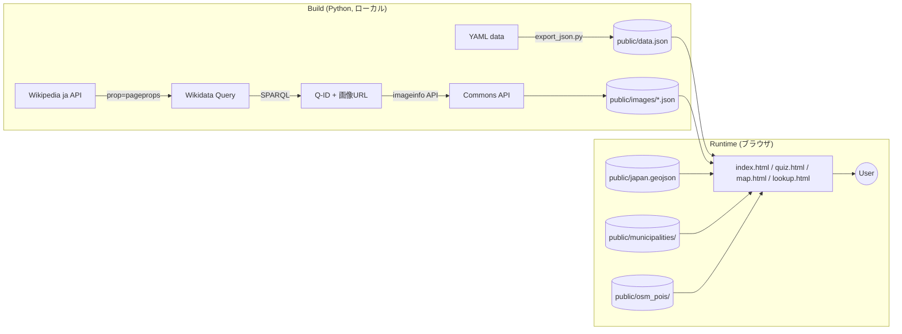

# 🗾 Nippon Geo Quest

> **Wikidata + Wikimedia Commons + 国土数値情報 + OpenStreetMap** から日本の地理データを自動収集し、写真クイズ・地図探索・早見表で楽しく学べる静的Webアプリ

[](LICENSE)
[](https://vercel.com)

## ✨ デモ

🌐 **Live Demo**: **<https://travel-geography-app.vercel.app>**

## 🎯 概要

「日本の観光地・温泉・郷土料理・世界遺産・国立公園 などを **Wikidata の SPARQL で Q-ID を解決し、Wikimedia Commons から写真をかき集めて見せる**」というデータパイプラインを軸にした静的Webアプリ。

ビルド工程ゼロ・サーバーレス・依存最小（Python標準ライブラリのみ）。1つの GitHub リポジトリで完結する**ETLパイプライン + フロントエンド**のポートフォリオ作品。

## 🏗️ アーキテクチャ



### データソース別の収集方法

| ソース | カテゴリ | 件数 | パイプライン |
|---|---|---:|---|
| **Wikidata + Commons** | 世界遺産・国立公園・温泉・祭り・郷土料理・観光地・山・川・島・湖・岬・駅・空港・JR路線 | 1,674画像 | `scripts/fetch_wikimedia_images.py` |
| **国土交通省** GeoJSON | 47都道府県境界 | 1ファイル | smartnews-smri/japan-topography 経由 |
| **国土数値情報** | 全国市区町村ポリゴン | 47ファイル | `scripts/download_municipalities.py` |
| **OpenStreetMap** Overpass | 観光資源POI（神社・寺・温泉・滝など） | 47ファイル | `scripts/fetch_osm_pois.py` |

## 🛠️ 技術スタック

| レイヤ | 採用 |
|---|---|
| フロントエンド | Vanilla JS（ライブラリなし） |
| スタイル | Tailwind CSS（CDN） |
| 地図描画 | 自前 SVG（GeoJSON → SVGパス、本土+沖縄の二重投影） |
| データ収集 | Python 3 標準ライブラリ（urllib, json, yaml） |
| ホスティング | Vercel（静的サイト、ビルド不要） |
| キャッシュ | LocalStorage（クイズスコア） |

## 🎮 機能

### 1. 📝 クイズ（12モード）
**文字ベース 7モード:**
- 都道府県 → 観光地、観光地 → 都道府県、温泉 → 都道府県
- 世界遺産 → 所在県、国立公園 → 都道府県、郷土料理 → 都道府県、空港 → IATAコード

**📸 写真ベース 5モード:**
- 写真 → 観光地名、写真 → 所在県、写真 → 世界遺産名、写真 → 温泉名、写真 → 郷土料理名

スコアは LocalStorage にモード別保存。

### 2. 🗾 地図（map.html）
GeoJSON ベースの本物の県境マップ。47都道府県を地方別に色分け、クリックで右側に詳細パネルを表示。
- ズームマップ（ホイール拡大、ドラッグ移動、ピンチ操作）
- 市区町村レイヤー（県別遅延ロード）
- OSM観光POIレイヤー（注目スポット / 主要カテゴリ / 全件 のフィルタ）
- 沖縄は本土から切り出して左上にデフォルメ配置

### 3. 📚 早見表（lookup.html）
タブ7種＋全文検索。世界遺産・国立公園・温泉・祭り・郷土料理は **Wikimedia Commons の写真つきカード**で表示。

## 📊 画像取得の達成率（73.2%）

| カテゴリ | 取得 / 全体 |
|---|---:|
| 世界遺産 | 24 / 26 (92%) |
| 国立公園 | 34 / 35 (97%) |
| 温泉 | 37 / 44 (84%) |
| 祭り | 30 / 34 (88%) |
| 郷土料理 | 72 / 87 (83%) |
| 観光地 | 584 / 832 (70%) |
| 山・峠 | 127 / 166 (76%) |
| 島嶼 | 77 / 100 (77%) |
| 湖沼 | 53 / 62 (85%) |
| 岬 | 55 / 80 (69%) |
| 川 | 101 / 133 (76%) |
| 主要駅 | 200 / 220 (91%) |
| **空港** | **82 / 82 (100%)** |
| JR路線 | 205 / 258 (79%) |
| **合計** | **1,674 / 2,159 (77.5%)** |

詳細は [docs/画像取得状況.md](docs/画像取得状況.md) を参照。

## 🚀 ローカル起動

```bash
# 静的サイトなのでビルド不要、Pythonの簡易サーバーでOK
python -m http.server 8000

# ブラウザで以下を開く
# http://localhost:8000/
```

## 🔄 データ再生成

```bash
# 1. YAMLから data.json を生成
python scripts/export_json.py

# 2. Wikimedia Commons から画像メタデータを取得
python scripts/fetch_wikimedia_images.py --category all

# 3. OSM 観光POI を再取得（30〜60分）
python scripts/fetch_osm_pois.py

# 4. 市区町村ポリゴンをダウンロード
python scripts/download_municipalities.py

# 5. データ整合性チェック
python scripts/validate.py
```

依存:
```bash
pip install pyyaml   # 唯一の依存
```

## 📂 ディレクトリ構成

```
travel-geography-app/
├── index.html / quiz.html / map.html / lookup.html  ← 4画面
├── css/style.css
├── js/                  ← data.js / quiz.js / map.js / coords.js / poi.js
├── public/              ← 配信されるデータ
│   ├── data.json        ← 統合JSON（YAMLから生成）
│   ├── japan.geojson    ← 県境ポリゴン
│   ├── images/          ← Wikimedia Commons メタデータ（14カテゴリ）
│   ├── municipalities/  ← 47都道府県の市区町村ポリゴン
│   └── osm_pois/        ← 47都道府県の観光POI
├── data/                ← YAMLソース（公開可フィールドのみ）
├── scripts/             ← Python ETL ツール
│   ├── sanitize_yamls.py
│   ├── export_json.py
│   ├── fetch_wikimedia_images.py
│   ├── fetch_osm_pois.py
│   ├── download_municipalities.py
│   └── validate.py
├── docs/
│   ├── ARCHITECTURE.md
│   └── 画像取得状況.md
├── README.md
├── LICENSE
└── vercel.json
```

詳細は [docs/ARCHITECTURE.md](docs/ARCHITECTURE.md) を参照。

## 📜 ライセンス

| 対象 | ライセンス |
|---|---|
| ソースコード（HTML/JS/CSS/Python） | **MIT** |
| YAML/JSON データ | 各ソースに従う（下記参照） |
| 画像 | Wikimedia Commons 各画像のライセンス（UI上に常時表示） |

### データソース・著作権表示

- 🌐 [Wikidata](https://www.wikidata.org/) — CC0
- 📸 [Wikimedia Commons](https://commons.wikimedia.org/) — 画像ごとに CC0 / CC BY / CC BY-SA
- 🗾 [国土数値情報（行政区域データ）](https://nlftp.mlit.go.jp/ksj/) — 国土交通省、出典明記
- 🌳 [環境省 国立公園 オープンデータ](https://www.env.go.jp/kanbo/koho/opendata.html) — 政府標準利用規約 v2.0（CC BY 4.0互換）
- 🏛️ [文化庁 文化遺産オンライン](https://bunka.nii.ac.jp/) — 政府標準利用規約 v2.0
- 📍 [OpenStreetMap](https://www.openstreetmap.org/) — © OpenStreetMap contributors（ODbL）

## 🤝 Contributing

Issue / Pull Request 歓迎。データ追加・スクリプト改善・UI 改善・新カテゴリの提案など。

```bash
git clone https://github.com/cosara22/travel-geography-app.git
cd travel-geography-app
python -m http.server 8000
```

## 📝 制作経緯

国内旅行業務取扱管理者試験の学習中に「観光地名と写真が一致しない」課題に直面し、Wikidata + Commons から自動的に写真を集めるパイプラインを実装。教材由来のテキストは含まず、公的・自由ライセンスのデータのみで再構成しています。

---

Built with ❤️ for travelers and geography enthusiasts.
