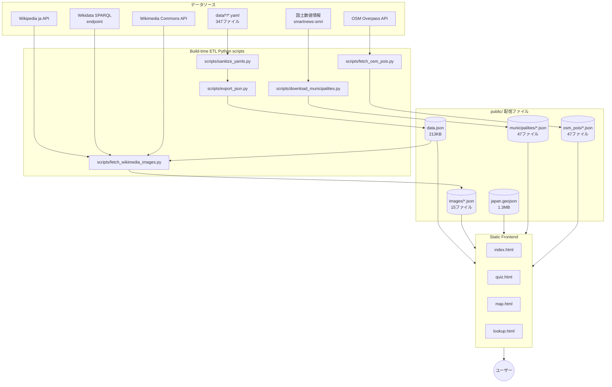

# Architecture

Nippon Geo Quest の技術構成と ETL パイプラインの解説。

## 全体像



## 画像取得パイプライン（3段）

`fetch_wikimedia_images.py` は商用利用可・無料の写真を Wikidata + Commons から自動収集する。

### Stage 1: Q-ID 解決（Wikipedia ja API）

```
GET https://ja.wikipedia.org/w/api.php
  ?action=query&prop=pageprops&ppprop=wikibase_item
  &redirects=1&titles=<日本語名>|...&maxlag=5
```

- 50件ずつバッチ
- リダイレクト・正規化を吸収
- 失敗時は `simplify_name(name, category)` でフォールバック:
  - カッコ以降を除去（`西大寺会陽（はだか祭り）` → `西大寺会陽`）
  - ハイフン以降を除去（`平泉-仏国土...` → `平泉`）
  - カテゴリサフィックスを試行（`知床` → `知床 (世界遺産)`）

### Stage 2: 画像ファイル名取得（Wikidata SPARQL）

```sparql
SELECT ?item ?image WHERE {
  VALUES ?item { wd:Q1234 wd:Q5678 ... }
  ?item wdt:P18 ?image.
}
```

- エンドポイント: `https://query.wikidata.org/sparql`
- 100件ずつバッチ、1 req/sec
- `?image` は `Special:FilePath/<filename>` 形式 → ファイル名抽出

### Stage 2.5: pageimages フォールバック（B案、商用安全フィルタつき）

P18 が未設定の Q-ID については Wikipedia 記事のリード画像を試行:

```
GET https://ja.wikipedia.org/w/api.php
  ?action=query&prop=pageimages&piprop=original
  &redirects=1&titles=...&maxlag=5
```

**重要**: `original.source` URL が `/wikipedia/commons/` で始まるもののみ採用。
`/wikipedia/ja/` 配下の Fair Use ローカルアップロードは商用 NG のため除外。

### Stage 3: ライセンス & サムネイル取得（Commons API）

```
GET https://commons.wikimedia.org/w/api.php
  ?action=query&prop=imageinfo
  &iiprop=url|extmetadata&iiurlwidth=400
  &titles=File:<filename>|...
```

- `extmetadata.LicenseShortName` → license
- `extmetadata.LicenseUrl` → license_url
- `extmetadata.Artist` → author（HTML除去・PD-self テンプレ整形）
- `imageinfo[0].thumburl` → 400px の Commons CDN URL

### マナー対策

- User-Agent: `NipponGeoQuest/1.0 (...; portfolio)`
- HTTP 429/503 → 指数バックオフ（1, 2, 4, 8 秒、最大4回）
- `maxlag=5` でサーバ負荷検知時に自動待機
- SPARQL 1 req/sec、Commons 0.5 req/sec
- `--cache .cache/` で resume 対応

## データ表示の3層構造

### 1. クエリ層（`js/data.js`）

```js
loadGeoData()         // public/data.json (キャッシュ)
loadImageIndex(cat)   // public/images/{cat}.json (キャッシュ)
ScoreStore            // localStorage でスコア管理
```

### 2. 描画層（カテゴリ別）

| ファイル | 担当 |
|---|---|
| `js/quiz.js` | クイズ（12モード）の生成と判定、写真表示、スコア記録 |
| `js/map.js` | 47都道府県 SVG 描画、ズーム、市区町村レイヤー、詳細パネル |
| `js/coords.js` | 47都道府県の緯度経度・配色テーブル |
| `js/poi.js` | OSM POI のフィルタリング・表示 |

### 3. 投影系

地図描画は GeoJSON ポリゴンを SVG パスに変換:

- **本土**: 経緯度バウンディングボックス `(128.5°E〜146.0°E, 30.5°N〜45.7°N)` で線形投影
- **沖縄**: 別の投影関数で左上にデフォルメ配置
- ズーム時は viewBox 操作で座標系を維持

## ライセンス遵守

各画像 `<figcaption>` に以下を必ず表示:

1. 撮影者名（`Artist` フィールド、HTML除去・PDテンプレ整形）
2. ライセンス名 + License URL のリンク
3. 元画像ページ（Commons File ページ）へのリンク

これで CC BY-SA 4.0 の attribution + license-link 要件を充足。

## 依存

| 種類 | 内容 |
|---|---|
| Python | 標準ライブラリのみ（`urllib`, `json`, `re`, `glob`, `time`） |
| Python (extra) | `pyyaml`（YAML読み書きのみ） |
| Frontend | 外部ライブラリゼロ（Tailwind は CDN）|
| Build | なし（静的サイト） |

## CI/CD

GitHub Push → Vercel 自動デプロイ（main ブランチ追従）。
データ更新は手動（`scripts/fetch_*.py` をローカル実行 → commit → push）。

## 拡張ポイント

- 新カテゴリ追加: `data/<category>/*.yaml` 作成 → `export_json.py` の `result` dict に追加 → `fetch_wikimedia_images.py` の `VALID_CATEGORIES` に追加
- 多言語対応: `images/*.json` に `description_en` 追加、UI を i18n 化
- PWA 化: Service Worker でオフラインキャッシュ
